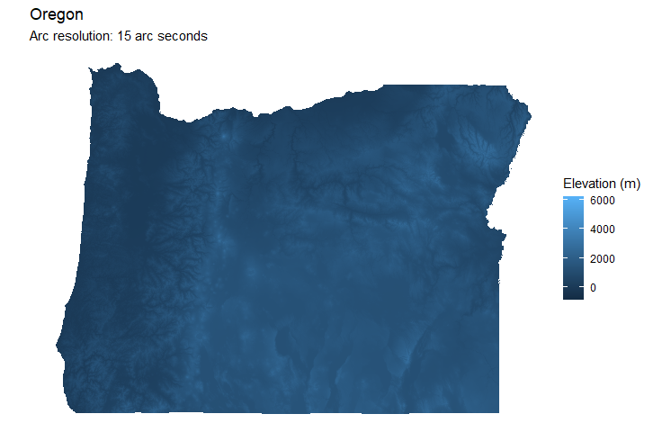
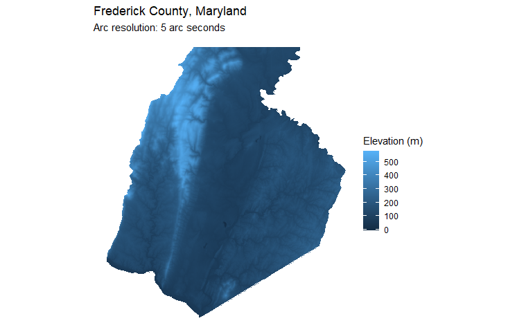
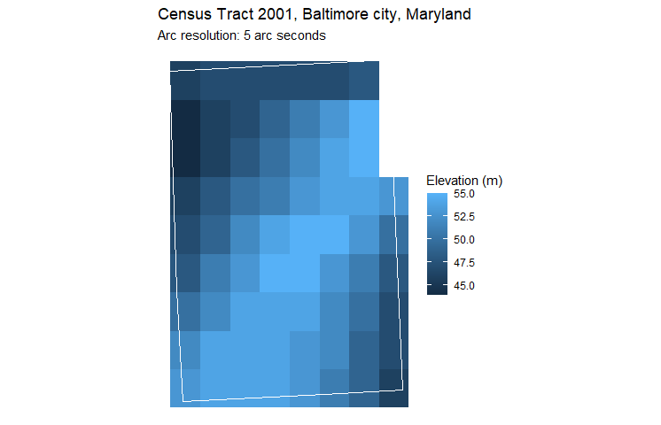
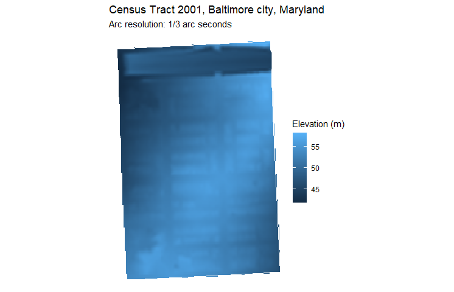

# elevationus
Retrieves elevation data for US geographies. Built on [tigris](https://github.com/walkerke/tigris) and [elevatr](https://cran.r-project.org/web/packages/elevatr/index.html). Takes a state, county or tract fips code and returns a map, a gridded raster of elevation data, raw elevation data and an estimate of mean elevation across the geography. 

## Installation
```
install.packages("devtools")
devtools::install_github("marsha5813/elevationus")
```

## Examples
### Get elevation data for the state of Oregon
```
library(elevationus)
elev <- get_elevation_data(level = "state", geoid = "41")
print(paste("Mean elevation:",elev$elevation_mean,"meters"))
elev$map
```
[1] "Mean elevation: 1072.76919775039 meters"


### Get elevation for just one county. 
Increase resolution to 5 arc seconds.
```
elev <- get_elevation_data(level = "county", geoid = "24021", z = 10)
print(paste("Mean elevation:",elev$elevation_mean,"meters"))
elev$map
```
"Mean elevation: 182.898839962032 meters"


### Get elevation for just one tract
Notice the pixelated elevation data at 5 arc seconds
```
elev <- get_elevation_data(level = "tract", geoid = "24510200100", z = 10)
print(paste("Mean elevation:",elev$elevation_mean,"meters"))
elev$map
```
"Mean elevation: 50.768115942029 meters"


### Get elevation for just one tract at higher resolution
Dial resolution up to 1/3 arc seconds
```
elev <- get_elevation_data(level = "tract", geoid = "24510200100", z = 14)
elev$map
```


## Notes
The 'z' argument ranges from 0 to 16 and is passed to [elevatr::get_elev_raster()](https://rdrr.io/cran/elevatr/man/get_elev_raster.html). See the [tilezen documentation](https://github.com/tilezen/joerd/blob/master/docs/data-sources.md) for data sources and resolutions returned at each level of z.

## Roadmap
* Round mean elevation to reasonable precision
* Option for population-weighted mean elevation
* Option for whole nation
